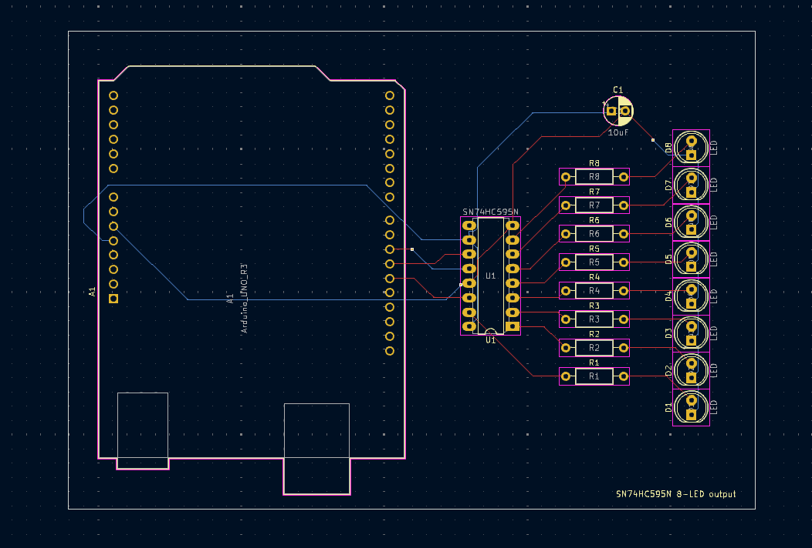
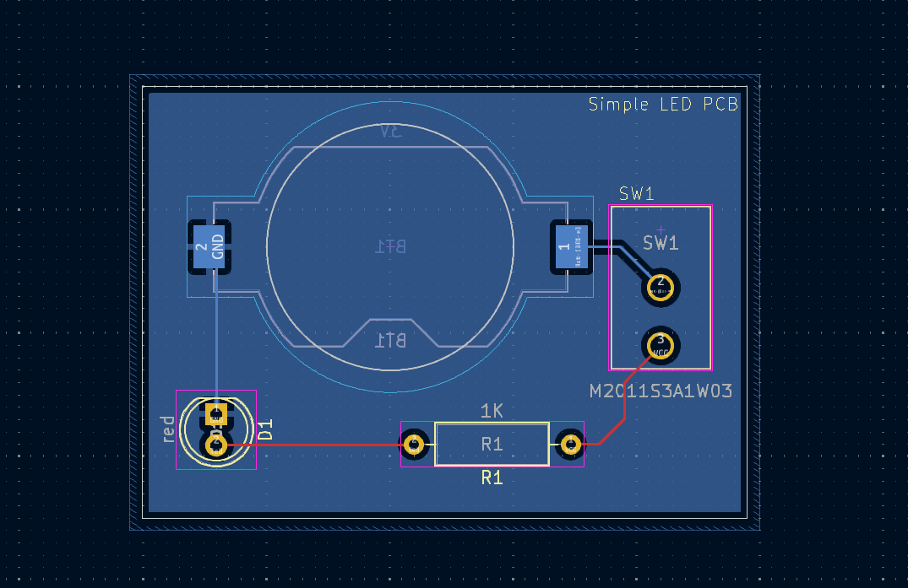

# pcb

This is a collection of schematics and PCB designs using KiCad. Each directory
contains one or more project directories, where each project has an associated
schematic and (possibly) a PCB design file.

## Schematics
Some schematics I've designed so far:

    
    
Arduino UNO and right-shift register with 8 LEDs

    
    
Simple LED schematic

## PCB Designs
Some PCB designs I've created so far:
    

    
    
Arduino UNO and right-shift register with 8 LEDs

    
    
Simple LED PCB

        
